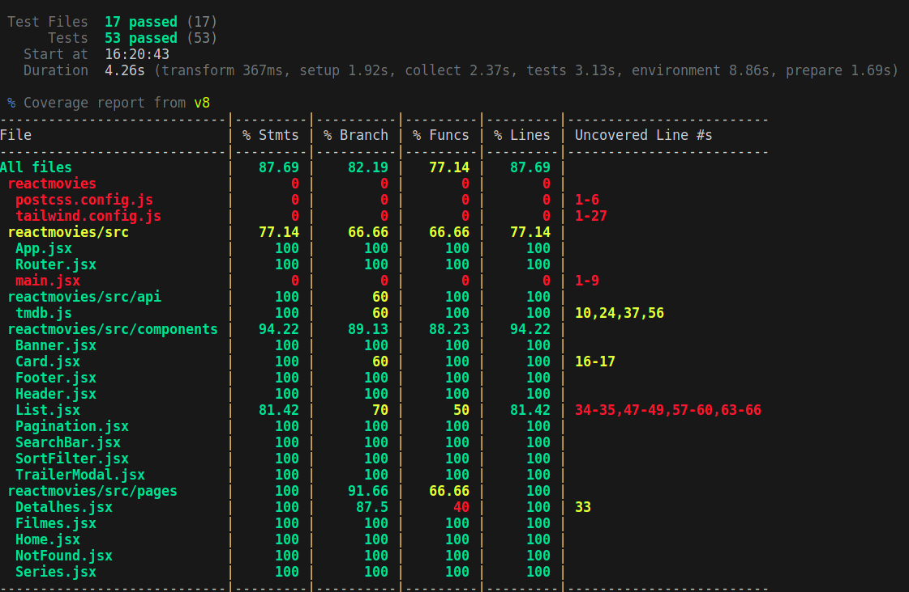

# React Movies 🎥

A React application to browse and discover movies and TV shows, featuring detailed pages, trailers, and more.

## 🚀 Live Demo

Check out the deployed app on Vercel:  
👉 [React Movies on Vercel](https://reactmovies-iota.vercel.app/)

## ✨ Design Reference

The project is based on this Figma design:  
👉 [Figma Project Link](https://www.figma.com/design/TfUYyO7lGs5KEtQnjErnaR/React-Movies-2.0-(Copy)?node-id=130-6&node-type=frame&t=dj1R1LGDh73mC7nM-0)

## 📦 Dependencies

The project uses the following dependencies:

- **[axios](https://axios-http.com/)**: For making API requests.
- **[react](https://react.dev/)**: JavaScript library for building user interfaces.
- **[react-dom](https://react.dev/)**: Provides DOM-specific methods for React.
- **[react-router](https://reactrouter.com/)**: Core routing library for React.
- **[react-router-dom](https://reactrouter.com/)**: DOM bindings for React Router.
- **[react-spinners](https://www.davidhu.io/react-spinners/)**: Loading spinners for React.

## Tailwind CSS

  

This project uses **[Tailwind CSS](https://tailwindcss.com/)**, a utility-first CSS framework for rapid UI development. Tailwind is configured in the `tailwind.config.js` file, and the global styles are imported in `src/global.css`.

#### Key Features of Tailwind CSS in This Project:

- **Responsive Design**: Tailwind's utility classes are used throughout the project for a fully responsive UI.
- **Customization**: Custom colors, spacing, and other utilities are configured in the Tailwind configuration.
- **Ease of Use**: Utility-first classes make it easy to build consistent and maintainable styles.

## Test Coverage Report

Below is a screenshot of the current test coverage for the project:

